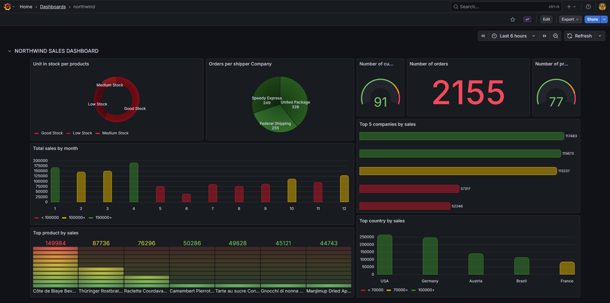
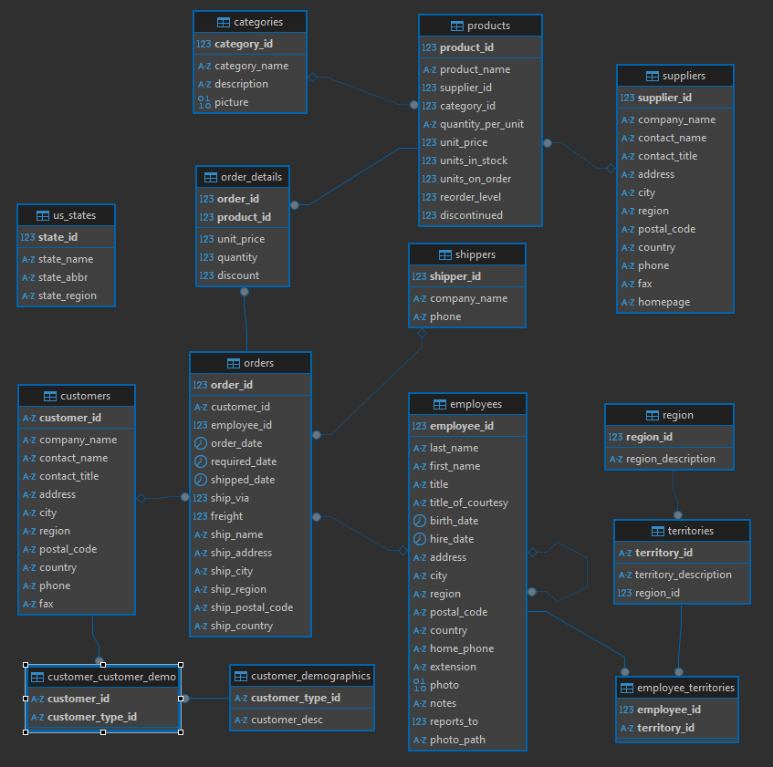
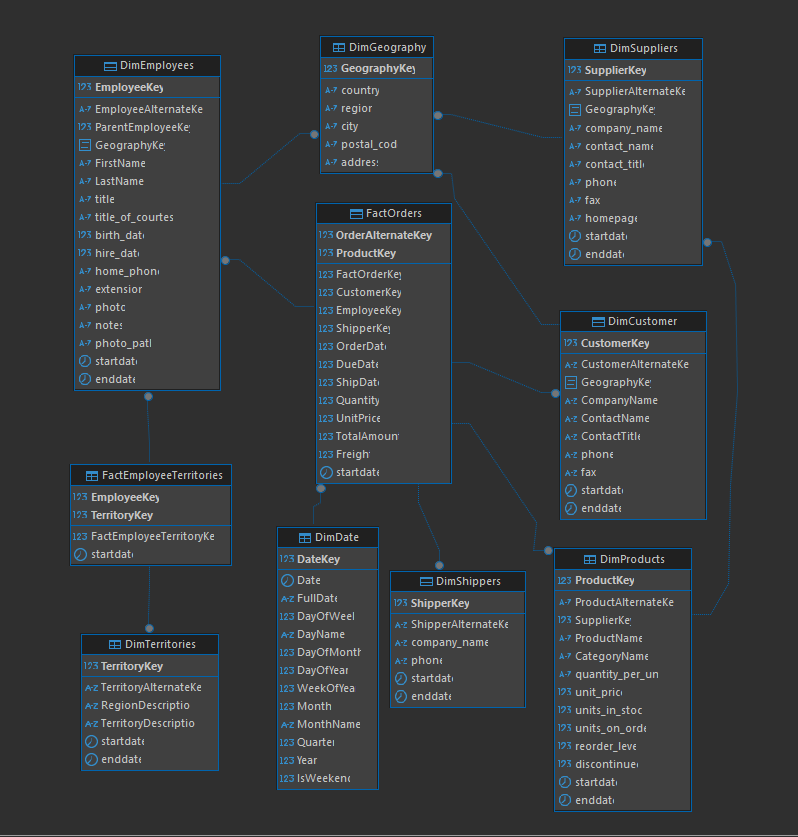
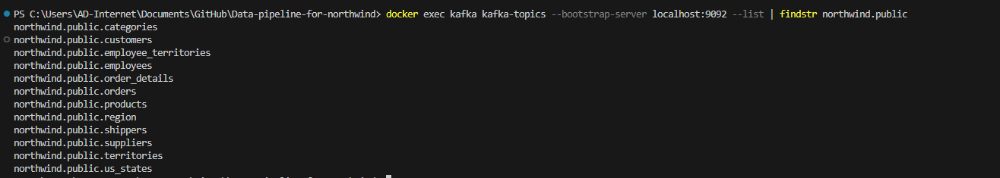
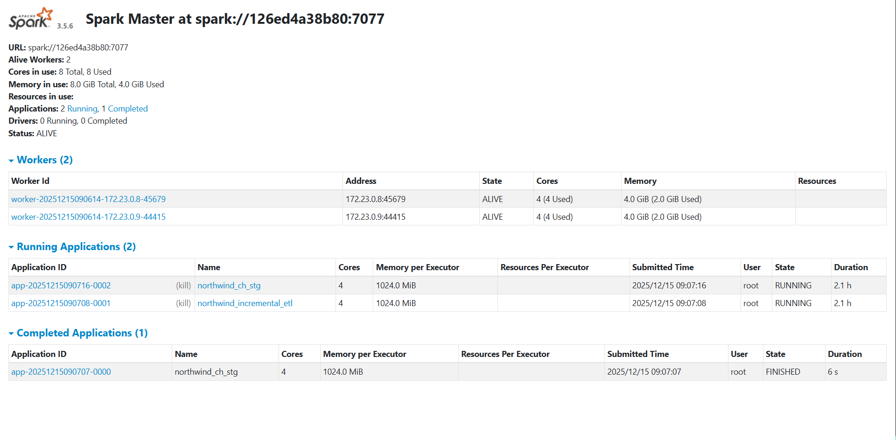
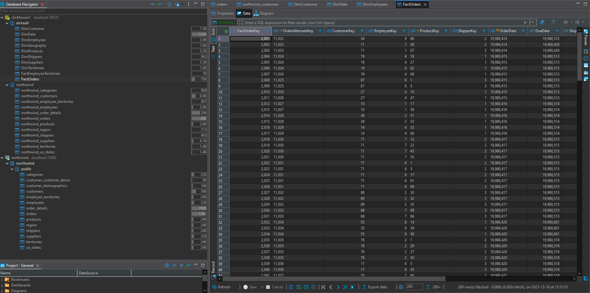
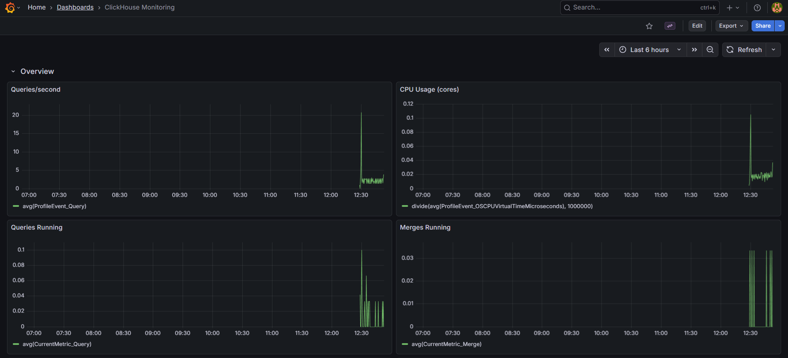
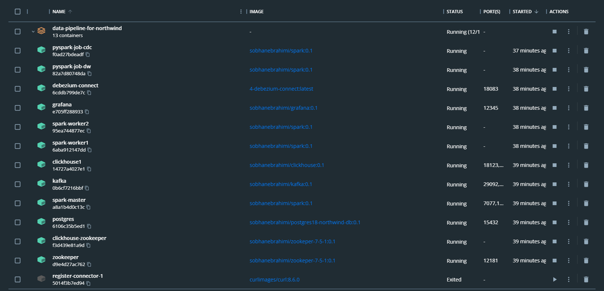

# Northwind Streaming Data Warehouse

Real-time CDC pipeline that streams Northwind OLTP changes from PostgreSQL into ClickHouse, shapes them into a star schema with Spark, and surfaces analytics in Grafana.

## Architecture at a Glance

```
PostgreSQL (OLTP) → Debezium → Kafka → Spark (CDC + DW ETL) → ClickHouse → Grafana
```

### Pipeline Flow
1. **PostgreSQL**: Source OLTP database containing the Northwind sample database
2. **Debezium**: Captures database changes using PostgreSQL logical replication
3. **Kafka**: Message broker that stores CDC events as topics
4. **Spark**: Processes streaming data and performs ETL transformations
   - **CDC Streaming Job**: Streams data from Kafka to ClickHouse staging tables
   - **DW ETL Job**: Builds star schema dimensions and facts from staging tables (incremental)(SCD2)
5. **ClickHouse**: Data warehouse with star schema design for analytical queries
6. **Grafana**: Visualization and monitoring dashboards

## Technology Stack

- **PostgreSQL 18**: Source database (OLTP)
- **Zookeeper**: Coordination service for Kafka and ClickHouse 
- **Debezium**: Change Data Capture connector
- **Apache Kafka**: Distributed streaming platform
- **Apache Spark**: Distributed data processing engine
- **ClickHouse**: Column-oriented database for analytics
- **Grafana**: Monitoring and visualization platform

## Prerequisites

- Docker and Docker Compose installed
- At least 16GB of available RAM
- Windows PowerShell (for Windows) or Bash (for Linux/Mac)
## Repository Layout

```
Data-pipeline-for-northwind/
├── 0-info/               # Diagrams & reference assets
│   ├── dw-design.PNG     # ClickHouse DW star schema
│   ├── grafana-dashboard.PNG
│   ├── northwind-oltp.PNG
│   └── northwind_test_data.sql
├── 1-postgres/           # PostgreSQL with Northwind data & logical replication
│   ├── docker-compose.yml
│   ├── Dockerfile
│   ├── northwind.sql
│   └── postgresql.conf
├── 2-zookeeper/          # Zookeeper base image for Kafka
│   └── Dockerfile
├── 3-kafka/              # Kafka broker
│   ├── docker-compose.yml
│   └── Dockerfile
├── 4-debezium/           # Debezium Connect container
│   ├── docker-compose.yml
│   └── Dockerfile
├── 5-clickhouse/         # ClickHouse warehouse (single replica enabled)
│   ├── docker-compose.yml
│   ├── Dockerfile
│   ├── config_replica1.xml
│   ├── config_replica2.xml   # replica2 wired but disabled
│   └── init-db/init.sql      # Staging + DW star schema DDL
├── 6-spark/              # Spark cluster + jobs
│   ├── docker-compose.yml
│   ├── Dockerfile
│   ├── conf/             # Spark defaults/templates
│   └── scripts/
│       ├── northwind-ch-stg.py   # Structured Streaming: Kafka → CH staging
│       ├── northwind-dw.py       # Incremental DW builder (SCD2, facts)
│       ├── northwind_schemas.py  # Debezium payload schemas
│       └── clickhouse-jdbc-0.7.2-all.jar
├── 7-grafana/            # Grafana provisioning + dashboards
│   ├── docker-compose.yml
│   ├── Dockerfile
│   ├── dashboards/*.json
│   ├── northwind_queries.sql
│   └── provisioning/
└── docker-compose.yml    # One-shot compose for all services
```

## Key Components & Ports

- **PostgreSQL** (Northwind OLTP): `15432->5432`, logical replication slot `debezium`, user `postgres/postgres`.
- **Debezium Connect**: `18083->8083`, auto-registers connector `postgres-northwind-connector`.
- **Kafka**: `39092->9092` (internal), `29092->29092` (external).
- **Spark**: master UI `18085->8080`, RPC `7077`. Jobs: `pyspark-job-cdc` (staging ingest) and `pyspark-job-dw` (DW).
- **ClickHouse**: `19000->9000`, `18123->8123`, user `default/123456`; replica2 config present but disabled.
- **Grafana**: `12345->3000`, default `admin/admin`.

All services share the `ProjectHost` Docker network.

## Data Flow

1. **CDC capture**: Debezium reads PostgreSQL WAL and publishes `northwind.public.*` topics.
2. **Streaming ingest** (`6-spark/scripts/northwind-ch-stg.py`):
   - Structured Streaming from Kafka with schema-aware parsing.
   - Writes to ClickHouse staging tables `northwind.northwind_*` (ReplacingMergeTree).
   - Date normalization for employee/order date fields.
3. **DW build** (`6-spark/scripts/northwind-dw.py`):
   - Incremental window using `last_run.txt`, polling every 20s.
   - SCD2 dimensions (customers, employees, suppliers, products, shippers, territories) with surrogate keys.
   - Fact tables: `FactOrders`, `FactEmployeeTerritories`; DimDate pre-seeded 1970–2050.
4. **Visualization**: Grafana dashboards query ClickHouse DW.

## Nortwind db design(oltp)


## Nortwind DataWarehouse design


## Run the Stack (recommended)

```powershell
# once
docker network create ProjectHost

# start everything
docker-compose up -d --force-recreate
```

To run per layer (if debugging): bring up `1-postgres`, `3-kafka`, `4-debezium`, `5-clickhouse`, `6-spark`, then `7-grafana` in that order (same compose commands with `-f <path>`).

## Operate & Verify

- Check containers: `docker ps`
- Debezium connector: `docker exec debezium-connect curl -s http://localhost:8083/connectors/postgres-northwind-connector/status`
- Kafka topics: `docker exec kafka kafka-topics --bootstrap-server localhost:9092 --list`
- ClickHouse staging sample: `docker exec clickhouse1 clickhouse-client --query "SELECT count(*) FROM northwind.northwind_orders"`
- DW sample: `docker exec clickhouse1 clickhouse-client --query "SELECT count(*) FROM FactOrders"`

### Logs & Monitoring
- Spark job logs: `docker logs -f pyspark-job-cdc` and `docker logs -f pyspark-job-dw`
- Spark UI: http://localhost:18085  
- Grafana: http://localhost:12345 (datasource + dashboards pre-provisioned)
- Debezium Connect API: http://localhost:18083


## Implementation Notes

- Staging uses ReplacingMergeTree to reconcile updates/deletes.
- DW ETL enforces SCD2 end-dating via ClickHouse `ALTER ... UPDATE` on surrogate keys.
- Dimension keying and fact upserts are handled via Spark-side surrogate key assignment to avoid collisions.
- `northwind_test_data.sql` and `1-postgres/northwind.sql` provide the base OLTP dataset.

## Stop Services

```powershell
# all
docker-compose down

# or individually (reverse order)
docker-compose -f ./7-grafana/docker-compose.yml down
docker-compose -f ./6-spark/docker-compose.yml down
docker-compose -f ./5-clickhouse/docker-compose.yml down
docker-compose -f ./4-debezium/docker-compose.yml down
docker-compose -f ./3-kafka/docker-compose.yml down
docker-compose -f ./1-postgres/docker-compose.yml down
```

## Troubleshooting Tips

- Ensure `ProjectHost` network exists: `docker network ls`
- Port conflicts: free `15432, 18083, 39092/29092, 19000/18123, 18085, 12345`
- If staging empty, confirm Debezium status and Kafka topic data using `kafka-console-consumer.sh`
- If DW empty, check `last_run.txt` inside Spark container and Spark logs for errors

## TODO

- Reaname ClickHouse dw name from default to nortwind-dw.
- Add automated smoke checks (topic existence, CH row counts) to a `make verify` script.
- Wire replica2 ClickHouse service and validate replication configs.
- Parameterize credentials/ports via `.env` templates per service.
- Add data-quality assertions inside `northwind-dw.py` (null key drop counts, thresholds).
- Publish sample Grafana dashboard screenshots in README for quick preview.


## picturs






